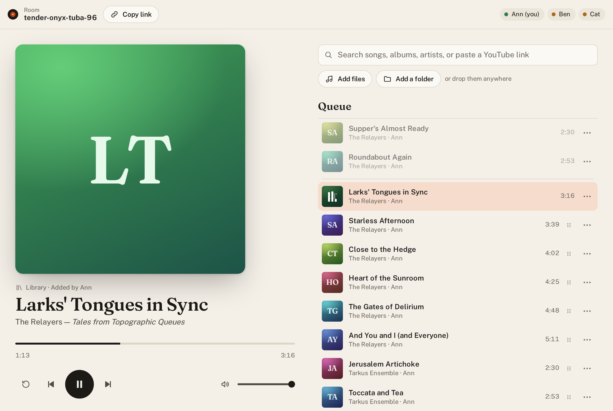
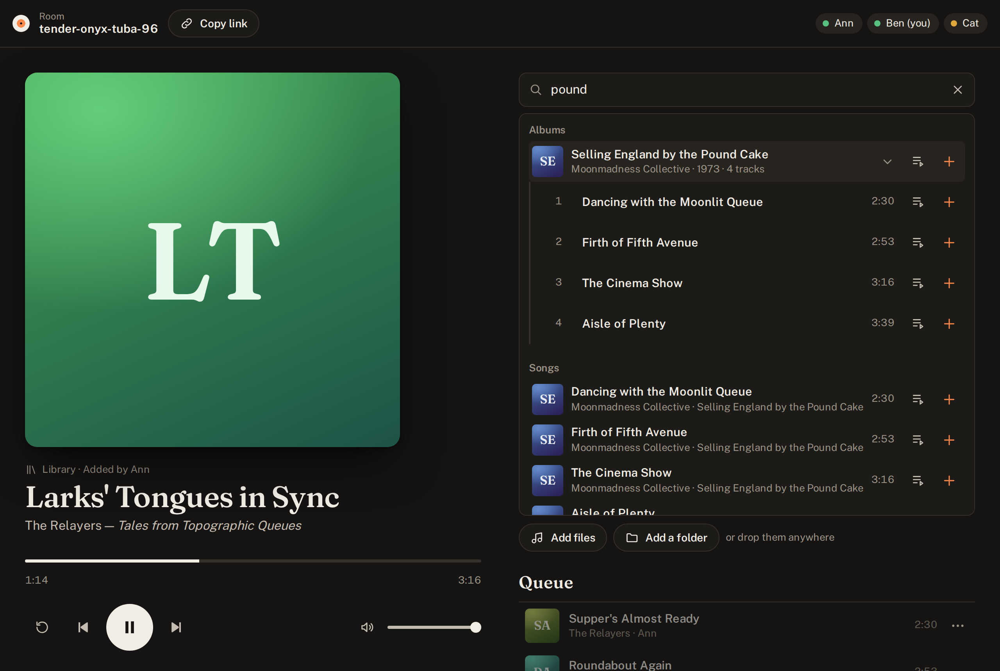

# Relayer

Listen to music together, in sync, from anywhere. Start a room, share the link,
and everyone who opens it hears the same thing at the same moment. Build the
queue together from audio files, whole album folders, YouTube links, or your
own music library.



Relayer is small, self-hosted, and runs as a single process or Docker
container. There are no accounts: the room link is all anyone needs. (The name
is a nod to the 1974 Yes album: the server relays one timeline to every
listener.)

## Features

- **Rooms with readable links** like `/r/quiet-amber-otter-42`. Anyone with the
  link joins with a display name and can do everything: play, pause, seek, skip,
  add, reorder, and remove.
- **Playback in sync.** Each browser plays the audio itself and a sync engine
  steers it to a shared timeline, so there's no echo between devices. Files stay
  within a few tens of milliseconds between browsers; YouTube within about half
  a second. Late joiners start at the right spot.
- **A shared queue** of uploaded files, whole album folders (drag and drop, or
  pick a folder), YouTube links, and tracks from a server music library. Played
  tracks fold away as history (clicking one plays it again), and can be cleared.
- **Room chat,** alongside what's happening in the room. Share a YouTube link in
  chat and anyone can add it to the queue with a click.
- **Notifications** when a song starts or someone sends a message while you're
  in another tab (over HTTPS; not on iPhone, where Safari doesn't allow them).
- **Your music library.** Point the server at a folder of music and rooms can
  search it by song, album, or artist and add whole albums in order.
- **YouTube search and playlists** with a free YouTube Data API key: search
  YouTube from the same box, and paste a playlist or YouTube Music album link to
  add all of it. Videos that can't play here are left out up front.
- **The details:** cover art, drag-to-reorder (touch too),
  lock-screen and media-key controls, keyboard shortcuts, light and dark themes,
  and layouts for phones and desktops.
- **Works in** current Chrome, Firefox, and Safari, on desktop and on phones.

## Quick start

With Docker:

```sh
git clone https://github.com/czahrien/relayer.git
cd relayer
docker compose up -d --build
```

Open <http://localhost:3000>, start a session, and share the room's link.
`compose.yaml` builds the image from the repo.

Prebuilt images for amd64 and arm64 are published to
[`ghcr.io/czahrien/relayer`](https://github.com/czahrien/relayer/pkgs/container/relayer):
`latest` is the newest release, `edge` follows the main branch, and each
release also gets its version tag (`0.1.0`, `0.1`). To use one, replace the
`build:` and `image:` lines in `compose.yaml` with
`image: ghcr.io/czahrien/relayer:latest`, and update with
`docker compose pull && docker compose up -d`.

To add your music library, create a `compose.override.yaml` next to
`compose.yaml` (it's gitignored) and restart:

```yaml
services:
  relayer:
    environment:
      LIBRARY_DIR: /music
    volumes:
      - /path/to/your/music:/music:ro
```

Without Docker, you need Node 20.19 or later (22 LTS recommended):

```sh
npm install
npm run build && npm start   # one process, one port (3000)
```

## How access works

There are no accounts or permissions. Know what that means before you put a
server on the internet:

- **The room link is the key.** Anyone with it can join the room, control
  playback, upload files, and search and add tracks from your library. Room
  names are random (about 446 million possibilities), so they can't practically
  be guessed, but share them like you'd share a private link.
- **Anyone who can reach the server can start a room**, unless you put `/start`
  behind a login at your reverse proxy (see [Restricting who can start
  rooms](#restricting-who-can-start-rooms)).
- **Uploads are limited:** by file (`MAX_UPLOAD_MB`), by room (`MAX_ROOM_MB`),
  and by keeping 512 MB of disk free. Empty rooms and their uploads are deleted
  after `ROOM_IDLE_TTL_MIN`, and nothing survives a restart.
- **Library files aren't directly reachable.** A track can only be fetched after
  someone adds it to a live room, through that room's media links. But anyone in
  a room can search your whole library.
- **YouTube plays through YouTube's official embedded player.** Nothing is
  downloaded or extracted from YouTube.

## Configuration

Environment variables:

| Variable | Default | Purpose |
|---|---|---|
| `PORT` | `3000` | Port the server listens on. |
| `DATA_DIR` | `./data` | Uploaded media (cleared on startup), and the library's index cache and album art. |
| `MAX_UPLOAD_MB` | `300` | Maximum size of a single uploaded file. |
| `MAX_ROOM_MB` | `2048` | Maximum total size of the uploads one room holds. `0` means no limit. |
| `ROOM_IDLE_TTL_MIN` | `60` | Minutes an empty room survives before it and its uploads are deleted. |
| `LIBRARY_DIR` | unset | A music folder rooms can search and play from. Unset disables the library. |
| `LIBRARY_RESCAN_MIN` | `360` | Minutes between library rescans. |
| `YOUTUBE_API_KEY` | unset | A YouTube Data API key, for YouTube search and playlist links. See [YouTube search](#youtube-search). |
| `CREATE_ROOM_ON_JOIN` | `true` | Whether opening a link to an unknown room creates it, so links keep working after a restart. Set to `false` when `/start` is behind a login. |

With Docker Compose, you can also set these (and `HOST_PORT`, the port on your
machine) in the environment or a `.env` file. Uploads live in the `media`
volume at `/data`.

## Server music library



Set `LIBRARY_DIR` to a folder of music (mounted read-only, with Docker) and a
search box appears in every room: search by song, album, or artist, add a song
or a whole album, or play something next.

- **Indexing:** the server indexes the folder in the background at startup and
  rescans it every `LIBRARY_RESCAN_MIN` minutes, re-reading only files that
  changed. A first scan of about 5,000 tracks takes a minute or so; later
  restarts are instant.
- **Formats:** only formats browsers can play are indexed (MP3, AAC/M4A, FLAC,
  Ogg Vorbis/Opus, WAV, WebM). ALAC, WMA, APE, and the like are skipped, since
  the app doesn't transcode.
- **Messy tags are handled sensibly:**
  - multi-disc sets ("Album - CD 1") are joined into one album;
  - untagged files take their title, track number, and album from their file
    and folder names;
  - cover art comes from embedded covers or images like `cover.jpg` or
    `Artwork/front.jpg`.

### Library report

`library-report` writes a Markdown report of problems in a library that the app
works around but that are better fixed in the files:

- formats browsers can't play;
- duplicate tracks;
- album tag typos;
- missing tags;
- artist spelling variants;
- albums without art.

It only reads the library and builds its own temporary index, so it's safe to
run while the server is up.

```sh
npm run library-report -- /path/to/music --out library-notes.md
docker compose exec -T relayer node server/dist/tools/libraryReport.js > library-notes.md
```

The library folder defaults to `LIBRARY_DIR`, and without `--out` the report
goes to standard output. A relative `--out` path is relative to where you run
`npm run`.

## YouTube search

Pasting single YouTube links works out of the box. With a YouTube Data API key,
rooms can also search YouTube (a YouTube tab next to Library), and pasting a
playlist link, including a YouTube Music album like
`https://music.youtube.com/playlist?list=OLAK5uy_…`, adds its videos in order.
Durations are known right away, and videos that can't play in an embedded
player are left out.

To get a key:

1. In the [Google Cloud console](https://console.cloud.google.com/), create a
   project.
2. Under **APIs & Services → Library**, enable **YouTube Data API v3**.
3. Under **APIs & Services → Credentials**, create an **API key**. Restrict it
   to the YouTube Data API v3.
4. Set `YOUTUBE_API_KEY` to it and restart the server.

The key stays on the server. Google's free quota allows 100 searches a day per
project; searches run when you press Enter, repeats within 10 minutes are
cached, and each room can search about once every 2 minutes after a first
burst of 10. Playlists and pasted links use a separate, much larger allowance.
When searches run out for the day, pasting links still works.

## Deploying

Put Relayer behind a reverse proxy with HTTPS: the clipboard and some
mobile browser features need it.

**Caddy** works as-is: its `reverse_proxy` forwards WebSockets. **nginx** needs
WebSocket upgrades forwarded and a larger upload limit:

```nginx
proxy_http_version 1.1;
proxy_set_header Upgrade $http_upgrade;
proxy_set_header Connection "upgrade";
client_max_body_size 300m;
```

### Restricting who can start rooms

Everything about creating a room happens under `/start`:
- `GET /start` is the start page, and `/` redirects there.
- Its form posts back to `/start`, which creates the room and redirects to it.

Everything a room needs stays public: `/r/*`, `/ws/*`, `/media/*`, `/api/*`, and `/assets/*`.

To require a login to start rooms:
1. **Protect `/start` at your proxy.**
2. **Set `CREATE_ROOM_ON_JOIN=false`.** Otherwise anyone could create a room just by
   opening `/r/<any-name>`. With it off, links to rooms that no longer exist show
   "This room doesn't exist".

For example, with Caddy and an authorization plugin:

```caddyfile
music.example.com {
	@protected path /start /start/*

	handle @protected {
		route {
			authorize with mypolicy
			reverse_proxy relayer:3000
		}
	}

	handle {
		reverse_proxy relayer:3000
	}
}
```

## Good to know

- **Joining starts the audio.** Browsers only allow sound after a click, so
  everyone clicks **Join and listen** when they enter a room.
- **Safari** can't smoothly speed up or slow down audio while it plays, so it
  stays in sync by making small jumps instead. After a track change you may hear
  one or two brief skips while it adjusts.
- **YouTube:** some videos, especially official music uploads, don't allow
  playback on other sites. Those are marked in the queue and skipped. On iPhone,
  the first YouTube video may need a tap on the video itself.
- **YouTube checks the site embedding it.** The embedded player decides whether
  to play based on the page's address, which the browser sends as its referrer.
  - Over a raw IP address (such as `http://192.168.1.20:3000`), many videos,
    music especially, are refused as "not allowed" even though they play fine
    through a hostname. Open rooms by name (even an internal one like
    `http://relayer.internal:3000`), not by address.
    [Others have hit this too.](https://github.com/Anonym-tsk/MMM-YouTube/issues/12)
  - Anything that strips the referrer breaks every video (YouTube's error 153),
    such as uBlock Origin's "Remove referrers" setting or a `no-referrer`
    policy added by a proxy in front of Relayer.
    [More on error 153.](https://til.simonwillison.net/youtube/fixing-153-embed)
  - Either way, only that listener misses out: their browser sits the video out
    and says why, and it plays on for everyone else. The room skips a video only
    when it fails for everyone.
- **Debugging sync:** press **D** in a room, or add `?debug` to the room link on
  a phone, to see clock offset, drift, and recent sync actions.

### Keyboard shortcuts

| Key | Action |
|---|---|
| Space | Play/pause |
| ← / → | Seek back/forward 10 s |
| Shift+← / Shift+→ | Previous / next |
| M | Mute |
| D | Toggle the debug panel |

## Development

```sh
npm install
npm run dev      # server on :3000, Vite dev server on :5173
npm test         # Vitest
npm run check    # TypeScript and svelte-check
```

The code is TypeScript throughout: a Fastify server, a Svelte 5 client, and a
shared package for the protocol and timeline math. [SPEC.md](SPEC.md) is the
design record: how the sync works, the protocol, the library, and the reasons
behind the decisions, including what it took to keep Safari in sync.

## License

Relayer is released under the [MIT License](LICENSE).

The web client bundles third-party packages and fonts (including Fraunces and
Public Sans under the SIL Open Font License 1.1). The build writes their
licenses to `third-party-licenses.txt`, linked from the start page and every room.
